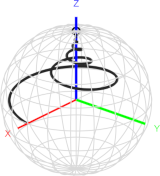

## BLOCHUS / pyBLOCHUS

**BLOCH** **U**niversal **S**imulator

- - -

### Table of Contents
1. [About](#about)
2. [Requirements](#requirements)
3. [Installation](#installation)
4. [Usage](#usage)
5. [Documentation](#documentation)
6. [ToDo](#todo)
7. [Cite as & References](#references)
8. [Changelog](CHANGELOG.md)

- - -

### About

**BLOCHUS** is a set of MATLABTM tools, that allow some basic simulations of (S)NMR spin dynamics based on the Bloch equations. The Bloch equations are solved in the laboratory frame of reference with MATLABs built-in `ode45` solver. Because it was developed within the scope of a near surface SNMR project, its main features are the simulation of (1) pre-polarization switch-off ramps and (2) excitation pulses. The main front-end to the underlying simulation tools is a graphical user interface (GUI) that allows playing around with the different features and helps to understand the basic concepts of (S)NMR spin dynamics.

#### pyBLOCHUS
**pyBLOCHUS** is a set of python modules that implement the core functionality of **BLOCHUS** without any graphical user interface. More information can be found [here](pyBLOCHUS).

#### Basic features:
1. Choose between different protons (e.g. *Hydrogen*, *Helium*, *Fluorine*, etc.)
2. Choose between different pre-polarization switch-off ramp shapes (e.g. *exponential*, *linear*, *half cosine*,  etc.) with arbitrary ramp time 
3. Choose between different excitation pulses (*pi/2*, *pi*, *adiabatic half passage*, etc.) with arbitrary off-resonance frequency, or in case of the adiabatic pulses, arbitrary frequency and current modulation.

| 

 | 

|:---:| :---: |
| 80ms *adiabatic half passage* (AHP) pulse |  3ms *linexp* pre-polarization switch-off ramp |

- - -

### Requirements

In order to work properly you need to meet the following requirements:

1. The [Mathworks](https://www.mathworks.com) MATLABTM software development environment (tested with R2017a and newer)
2. The GUI Layout Toolbox (get it from [FEX](https://de.mathworks.com/matlabcentral/fileexchange/47982-gui-layout-toolbox)) (required)
3. `findjobj` (get it from [FEX](https://de.mathworks.com/matlabcentral/fileexchange/14317-findjobj-find-java-handles-of-matlab-graphic-objects)) (required)

#### Operating System

I tested it successfully under Windows 7 (64bit) and 10 (64bit) with Matlab R2017a and newer. Always with the latest version of the GUI Layout Toolbox (current version is afaik v2.3.6)

**NOTE:** So far I did not test anything on Linux or a Mac. If you get it to work on either of the two systems (which it basically should I guess) please let me know.

- - -

### Installation

1. It is recommended to install the GUI Layout Toolbox directly into MATLABTM via the mltbx-file (but it should also work via the old-school way of adding the toolbox folders to the MATLABTM path)
2. To use **BLOCHUS** you just need to place the `blochus` folder from  the git repository on your hard drive and use the start script `startBLOCHUS` (within this script all necessary **BLOCHUS** folders are added to the MATLABTM path)

- - -

### Usage

1. By executing the start script (see above)
2. Simply type `BLOCHUS` on the MATLABTM prompt (make sure the `blochus` folder is on the MATLABTM path)
3. Check the example scripts for the usage of the core functions without the GUI (inside the `scripts` folder)

- - -

### Documentation

A basic documentation to **BLOCHUS** can be found in the `blochus\doc` folder. Just open the `index.html` in the web browser of your choice. The documentation was created with [m2html](https://www.artefact.tk/software/matlab/m2html/) by Guillaume Flandin.

- - -

### ToDo

In no particular order and without guarantee that it will ever happen :-) :

1. A real Manual
2. ...

- - -

### Cite as
If you use BLOCHUS for your research, please cite it as:

Thomas Hiller. (2022, Jun 30). ThoHiller/nmr-blochus: v0.1.5 (Version v0.1.5). Zenodo. [https://doi.org/10.5281/zenodo.3829464]

Note: Even though the version number might change due to updates, this DOI is permanent (represents all versions) and always links to the latest version.

### References
1. Splith, T., Hiller, T. and Müller-Petke, M. "Bloch-Siegert Effect for Surface Nuclear Magnetic Resonance Sounding Experiments in the Unsaturated Zone", *Applied Magnetic Resonance*, 2023, [DOI](https://doi.org/10.1007/s00723-023-01582-3)
2. Hiller, T., Costabel, S., Dlugosch, R., Splith, T. and Müller-Petke, M., "Advanced surface coil layout with intrinsic noise cancellation
properties for surface-NMR applications", *Magnetic Resonance Letters*, **3**(2), p.140-149, 2023, [DOI](https://doi.org/10.1016/j.mrl.2023.03.008)
3. Hiller, T., Costabel, S., Dlugosch, R. and Müller-Petke, M., "First Measurements of Surface Nuclear Magnetic Resonance Signals Without an Oscillating Excitation Pulse – Exploiting Non-Adiabatic Prepolarization Switch-Off", *Geophysical Research Letters*, **48**(23), e2021GL095371, 2021, [DOI](https://doi.org/10.1029/2021GL095371)
4. Hiller, T., Costabel, S., Radic, T., Dlugosch, R. and Müller-Petke, M., "Feasibility study on prepolarized surface nuclear magnetic resonance for soil moisture measurements", *Vadose Zone Journal*, **20**(5), e20138, 2021, [DOI](https://doi.org/10.1002/vzj2.20138)
5. Hiller, T., Dlugosch, R. and Müller-Petke, M., "Utilizing pre-polarization to enhance SNMR signals - effect of imperfect switch-off", *Geophysical Journal International*, **222**(2), p.815-826, 2020, [DOI](https://doi.org/10.1093/gji/ggaa216)

- - -

 MATLAB is a registered trademark of The Mathworks, Inc. 

